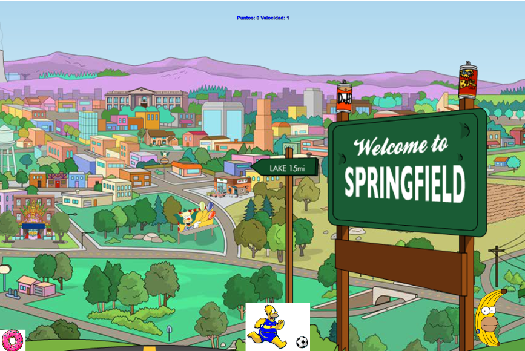

#  El Sueño del Levantapalas: La Carrera por el Morfi

UTN - Facultad Regional Buenos Aires - Materia Paradigmas de Programación

## Equipo de desarrollo: 

- Bermejo Fernández, Matías.
- Corro Molas, Agustin.
- Britos, Aylen.
- Dimotta, Cecilia.
- Giangrandi, Agostino.
 
## Capturas 

## Reglas de Juego / Instrucciones

Descripción del Juego:
Homero, el "levantapalas 3000", decidió ceder su puesto en la central nuclear a pasantes de la UTN. Ahora trabaja desde casa, ¡pero hay un problema! Nunca usó una computadora y se quedó dormido intentando encontrar la "tecla cualquiera". En su sueño, Homero debe atrapar comida que cae del cielo, pero cuidado: no toda la comida es buena, y las cosas se complican con cada nivel. ¡Ayuda a Homero a comer bien y ganar!

Objetivo del Juego:
Atrapa comida para sumar puntos y alcanza el puntaje necesario antes de que el tiempo se agote.
Si consigues el puntaje requerido, pasas al siguiente nivel. Si no lo logras, "Over Game".

Cómo Jugar:
    Movimiento:
        Homero solo se puede mover de izquierda a derecha.
        Desplázalo para atrapar la comida que cae del cielo con Space.
    Tipos de Comida:
        Buffea (suma puntos): Ejemplos como choripanes, donas, plutonio, cerveza, mate.
        Nerfea (resta puntos): Ejemplos como banana, ensalada, te, polenta.

Mecánica del Juego:
    1. Puntos y Niveles:
        Cada comida atrapada puede sumar o restar puntos.
        Debes alcanzar el puntaje objetivo antes de que el tiempo termine para avanzar al siguiente nivel.
    2. Dificultad Progresiva:
        Más puntos necesarios en cada nivel.
        Más comidas nerfeadoras que restan puntos.
        Mayor velocidad de aparición de la comida.
        Mayor velocidad de caída de los objetos.

Consejos para Ganar:
    Evita las comidas nerfeadoras y enfócate en atrapar los buffeos.
    Administra el tiempo y prioriza las comidas con más puntos.
    Ten cuidado: ¡A mayor nivel, más rápido todo se pone!

## Controles:

- `A` para moverse a la izquierda.
- `D` para moverse a la derecha.
- `Space` para agarrar objeto.
